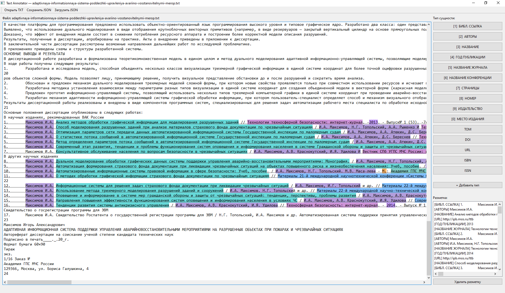

<p align="center"> 
<h><b>ИЗВЛЕЧЕНИЕ И РАЗБОР БИБЛИОГРАФИЧЕСКИХ ССЫЛОК ИЗ РУСО- И АНГЛОЯЗЫЧНЫХ НАУЧНЫХ ПУБЛИКАЦИЙ  <br> (ПО ТЕКСТАМ, ИЗВЛЕЧЕННЫМ ИЗ PDF) </b></h>
</p>


**Цель** – разработать, реализовать и экспериментально исследовать воспроизводимый программный конвейер, который для каждого документа (научной публикации) корпуса находит список литературы, разбивает его на отдельные записи, извлекает из каждой записи структурированные поля в исходном виде и сохраняет результат в едином машиночитаемом формате.\
**Задачи**
1. Локализация блоков. Обнаружение библиографических разделов в сплошном тексте.
2. Сегментация блоков. Разбиение блока на отдельные записи при нарушенной или отсутствующей нумерации, раздельный учет ошибок дробления и склейки.
3. Разбор полей записей. Извлечение полей в исходном виде, сравнение не менее двух подходов (дообучение готовых инструмент ов типа Grobid, собственная классификация на мультиязычном трансформере, LLM со схемой стилей).
4. Оценка качества. Эталонная разметка, метрики для тестовой выборки (отдельно по полям и по языкам), таксономия ошибок с указанием происхождения.

**Исходные данные**\
Корпус из нескольких десятков тысяч текстов научных публикаций (статей и докладов) на русском и английском языках, полученных из документов PDF и содержащих типичные искажения. Стили библиографических ссылок могут быть разными (ГОСТ, APA, IEEE и т.д.). Обязательные для извлечения поля: авторы, название, год публикации, источник (журнал, конференция), страницы, DOI или URL (при наличии), желательные - том, номер, издательство, место издания, ISBN/ISSN.\
**Требования к результату и критерии качества**\
Результат – файл JSONL, одна строка на документ, с блоками, записями и полями. Ключевой принцип – извлечение «как есть»: каждое значение поля обязано быть подстрокой исходной строки с точностью до склейки переносов и нормализации пробелов, для обязательных полей хранятся символьные границы (для автоматической проверки). Отсутствующее поле принимает значение null. Внешние источники (Crossref, OpenAlex) могут быть использованы для диагностики и не подменяют извлеченные значения. Каждому полю каждой записи присваивается также оценка уверенности.\
Обучение на тестовой выборке не допускается.

Целевые показатели:
<table border="1">
<tr>
<td> Этап
<td> Показатель качества
<td> Порог
</tr>
<tr>
<td> Локализация
<td> Полнота обнаружения блоков (по документам где списпок есть) 
<td> ≥ 0,95
</tr>
<tr>
<td> Сегментация
<td> Доля записей с точно восстановленными границами
<td> ≥ 0,90
</tr>
<tr> 
<td> Разбор полей
<td> F1
<td> ≥ 0,85
</tr>
</table>

**Итог:** репозиторий с воспроизводимым запуском, эталонный корпус, результаты по корпусу, отчет.

---

<p align="center"> 
<h><b> ОТЧЁТ ПО РАБОТЕ <br>
ИЗВЛЕЧЕНИЕ И РАЗБОР БИБЛИОГРАФИЧЕСКИХ ССЫЛОК ИЗ РУСО- И АНГЛОЯЗЫЧНЫХ НАУЧНЫХ ПУБЛИКАЦИЙ  <br> (ПО ТЕКСТАМ, ИЗВЛЕЧЕННЫМ ИЗ PDF) </b></h>
</p>

---

<p align="center"> 
<h><b> ВВЕДЕНИЕ </b></h>
</p>

В рамках наукометрических исследований, основанных на общедоступных научных публикациях, требуется определять сферу интересов автора и его потенциальные связи с другими авторами на основании библиографических ссылок на другие публикации. Для этого необходимо оперировать такой информацией, как название упоминаемой работы, имена авторов, журналы, которые бубликуют эти статьи или конференции, на которых выступали их авторы. Эту информацию можно назвать метаданными научной работы.

В современной практике такие данные либо являются атрибутами документа, ассоциированными с ним в системе публикаций, либо могут быть легко извлечены из документа, хранящегося в качестве электронного файла популярного формата PDF (Portable Document Format).

Однако до недавнего времени единственным общедоступным источником информации о публикуемой научной работе являлся сам печатный экземпляр данной работы. Некоторые экземпляры осели в библиотеках, где были отсканированы и сохранены в виде растрового графического изображения каждой страницы.

Для анализа цифровых копий научных работ приходится привлекать человеческий труд. Необходимую информацию легко выделить визуально в силу того, что формат автореферата регламентируется ГОСТ. Но монотонная работа по ручному переписыванию метаданных вызывает накопление усталости в организме работника, за которым следует рост ошибок.

Закономерно возникает потребность в автоматизации процесса выделения метаданных из графических электронных копий авторефератов диссертаций. Этот процесс можно разделить на три этапа. Сперва производится извлечение текстовых слоёв из изображений. Им также можно присвоить такие свойства как размер и выравнивание по странице. Затем осуществляется сегментация текста. И наконец - распознавание именованных сущностей (NER – Named Entity Recognition).

Сегментация текста по форме и содержанию осложняется искажением и зашумлением текста. Эти факторы могут быть следствием дефектов исходного документа, ошибок при сканировании, низкого качества изображения. Процесс преобразования изображения в текст также вносит значительные искажения при попытках конвертирования иллюстраций. 

При подготовке к изложенной работе первый этап был выполнен, поэтому технологии распознавания текста не будут освещены.

Таким образом, данная работа посвящена обзору методов извлечения структурированных метаданных авторефератов диссертаций на основе гибридных подходов.

<p align="center"> 
<h><b> ПРИМЕНЯЕМЫЕ МЕТОДЫ ИЗВЛЕЧЕНИЯ МЕТАДАННЫХ </b></h>
</p>

Для выполнения задач, изложенных в данной работе, будут применены гибридные инструменты и методы, включающие в себя:
1. Сравнение элементов текста с шаблонами (regexp – regular expression). Данный метод также требует написания прикладного ПО с развесистым деревом условных операторов. Также необходимо составить базу ключевых слов, которые будут использованы для выявления полей. К таким ключам можно отнести имена, слова “литература”, “рецензия” итд. В силу зашумлённости текста и изменений формы существительных и имён собственных посимвольное сравнение слов является малоэффективным. Задача требует применения помехоустойчивых методов сравнения, например ВКФ или расстояние Левенштейна.
2. 

<br> 
<p align="center"> 
<h><b> МЕТРИКИ КАЧЕСТВА ИЗВЛЕЧЕНИЯ БИБЛИОГРАФИЧЕСКИХ ССЫЛОК </b></h>
</p>

Выполнение алгоритма можно разделить на несколько этапов. <br>
Плохое качество исполнения этапа ухудшает исходное состояние следующего этапа, а их реализация может различаться. Таким образом, для оценки качества исполнения каждого этапа нужно применить соответсвующие метрики. 

1. **Локализация блока библиографических ссылок**\
На данном этапе алгоритма выделяется участок текста, в котором перечислены библиографические ссылки.\
Метрика -- Полнота обнаружения блоков.\
Целевой показатель -- ≥ 0,95
2. **Сегментация**\
Выделение библиографических записей, например
    > "1. Максимов И.А. Анализ методов обработки графической информации для моделирования разрушенных зданий // Технологии техносферной безопасности: интернет-журнал. -2013. - Выпуск№ 1 (53). -7с,- Режим доступа: http://ipb.mos.ru/ttb."

    Метрика -- Доля записей с точно восстановленными границами\
    Целевой показатель -- ≥ 0,90

3. **F1**\
Выделение отдельных полей, например
    >Максимов И.А.

    >Анализ методов обработки графической информации для моделирования разрушенных зданий

    Метрика -- F1
    Целевой показатель -- ≥ 0,85

<br> 
<p align="center"> 
<h><b> ЭТАПЫ ВЫПОЛНЕНИЯ РАБОТЫ </b></h>
</p>

Сперва необходимо собрать датасет.
>Датасет (набор данных) — это упорядоченная совокупность информации, собранная для анализа, проверки гипотез или обучения моделей искусственного интеллекта и машинного обучения

В моём случае -- это набор человеко/машинночитаемый набор записей об именованных сущностей с информацией достаточной для локализации сущности в документе и определения её принадлежности к одному из возможных классов.
Датасет представляет собой JSON-файл с записями следующего вида:
``` json
    {
        "children": [
            {
                "end": 39065,
                "label": "АВТОРЫ",
                "start": 39052,
                "text": "Максимов И.А."
            },
            {
                "end": 39150,
                "label": "НАЗВАНИЕ",
                "start": 39066,
                "text": "Анализ методов обработки графической информации для моделирования разрушенных зданий"
            },
            {
                "end": 39276,
                "label": "URL",
                "start": 39255,
                "text": "http://ipb.mos.ru/ttb"
            },
            {
                "end": 39214,
                "label": "ГОД ПУБЛИКАЦИИ",
                "start": 39210,
                "text": "2013"
            },
            {
                "end": 39207,
                "label": "НАЗВАНИЕ ЖУРНАЛА",
                "start": 39154,
                "text": "Технологии техносферной безопасности: интернет-журнал"
            }
        ],
        "end": 39277,
        "label": "БИБЛ. ССЫЛКА",
        "start": 39049,
        "text": "1.\tМаксимов И.А. Анализ методов обработки графической информации для моделирования разрушенных зданий // Технологии техносферной безопасности: интернет-журнал. -2013. - Выпуск№ 1 (53). -7с,- Режим доступа: http://ipb.mos.ru/ttb."
    },
```

В данном формате присутствуют записи двух уровней:
1. Запись о библиографической сслыке, называемая ```"БИБЛ. ССЫЛКА"```. Она хранит в себе
    1. тип записи ```"label"```
    1. номер первого симпола документа, являющегося ссылкой ```"start"```
    1. номер первого симпола документа, являющегося ссылкой ```"end"```
    1. содержание ```"text"```
    1. поля составляющих ссылку сущностей ```"children"```
1. сущности, составляющие библиографическую ссылку. Они в свою очереь состоят из таких же полей:
    1. тип сущности ```"label"```
    1. номер первого симпола документа, являющегося ссылкой ```"start"```
    1. номер первого симпола документа, являющегося ссылкой ```"end"```
    1. содержание ```"text"```

Данный формат оказался удобным.
Он позволяет обучающему алгоритму локализовать сущности в документе или внутри библиографических ссылок, находить границы библиографических ссылок и локализовать блок.
В дополнение данные легко воспринимаются человеком при проверке датасета.

Исходные данные представляют собой 47 текстовых документов на русском языке в формате .txt. В них содержится 559 библиографических ссылок и 3692 именованные сущности. Перенос данных данных в JSON-записи оказался трудоёмкм занятием, поэтому для минимизации сопутсвующего ущерба для психики средствами автомтизированного вайбкодинга (САВ) было рарзработано прикладное программное обеспечение (ПО) для разметки данных.

<figure>
   
  <figcaption><p align="center">Рисунок -- 1. Схема архитектуры разрабатываемого проекта.</p></figcaption>
</figure>

ПО позволяет размечать данные, совершая несколько простых действий:
1. открыть файл исходных данных
1. выделить библиографическую ссылку и нажать соответсвующую кнопку или клавишу на клавиатуре
1. выделить входящие в ссылку именованные сущности
1. поврорить операции для других библиографических ссылок
1. повтор
1. при необходимости удалить ошибочно выделенную область
1. сохранить датасет в формате JSON
1. загрузить датасет, чтобы проверить корректность разметки

ПО реализовано на языке C++ и может быть запущено на персональном компьютере работающим под операцицонной системой Windows 10 и старше.

Для консистентности разметки были сформулированы следующие принципы:
1. Данные в каждом поле не должны быть избыточны. То есть, данные не должны содержать такие данные как "под редакцией В.В.Пупкина", едницу измерения лет "г.", разделителей между полями
1. Пользователь должен иметь возможность понять вывод алгоритма предстказания не прибегая к использованию специализированного ПО. Например, вывод номера страницы обычно имеет вид "С.: 7". Пользователь должен быть убеждён, что 7 - это номер страницы публикации, указаннй в ссылке, а не номер страницы документа, на котором расположена ссылка.

Очевидно, что принципы протеворечат друг другу в некоторых ситуациях, поэтому я менял приоритеты принципов по мере того, как менялось моё мнение относительно их ценности.

В соответсвии с дизъюнкцией обоих принципов были сформулированы правила разметки:

находишь в конце список публикаций автора, они внизу
для каждой из перечисленных публикаций:

1. выделяешь всю публикацию
    1. если публикация растянута на три строки (это она на пдфке расположена на границе страниц, иногда на второй строке записан номер страницы) выделяешь все три

2. выделяешь фио авторов
    
    1. если авторов несколько, выделяешь всех одним выделением
    1. если слева и справа от названия указаны авторы, выделяешь обе группы
    1. Не выделяешь то, что не является именем автора, например, "и др" или "под редакцией/руководством Василия П."

3. выделяешь название
    
    1. если название заключено в кавычки, выделяешь то, что внутри кавычек
    1. если название включает в себя текст, заключённый в кавычки, то их тоже выделяешь

4. выделяешь год публикации
    
    1. не выделяешь "г" в записи, только число

4. выделяешь название журнала
    
    1. единственный чёткий критерий - слово "журнал"
    1. названия могут быть замысловатые, если название похоже на название журнала, тыкай журнал
    1. если увидешь два куска текста, похожих на название журнала, выбирай первое
    1. если название содержит слова ": интернет-журнал", ": журнал",  выделяй всё

5. выделяешь название конференции
    
    1. единственный чёткий критерий - слово "конференция"
    1. названия могут быть замысловатые, выделяй, если название похоже на название конференции
    1. если увидешь два куска текста, похожих на название журнала, выбирай первое
    1. если название содержит слова ": интернет-конференция", ": конференция",  выделяй всё
    1. если написано типа "материалы международной конференции Международная конференция", выделяй всё

6. выделяешь страницы
интересует информация, по которой можно определить расположение цитируемой информации

    1. не выделяй, если написано число страниц, например "7с
    1. выделяй, если написан диапазон страниц, например "С. 3-11", выделяй  целиком
    1. выделяй, если написано "С. 3", выделяй целиком 

7. выделяешь DOI

8. выделяешь URL
    1. выделяешь только ссылку, то есть то, по чему можно клинкнуть и перейти на сайт

9. выделяешь том
    1. если видишь "Том 1" или "Том №1", выделяешь всё

10. выделяешь номер
    1. номер, вероятно то, что стоит особняком и выглядит аналогично " -№ 4"
    1. слова наподобие "Выпуск номер" не выделяй, я пока не знаю, как это интерпретировать

11. выделяешь издательство
    1. выделяй, если написано "издатаельство" или "изд"
    1. выделяй, если это стоит ближе к концу, и похоже на название или название вуза

12. выделяй место издания
я решил, что это город
    1. выделяй, если написано "М." или "М"
    1. выделяй, если написан топоним
    1. выделяй, если написано несколько топонимов, например "Украина, Ялта-Гурзув"

13. выделяй ISBN
    1. выделяй "ISBN: " и код вместе

14. выделяй ISSN
    1. выделяй "ISSN: " и код вместе


<br> 
<p align="center"> 
<h><b> РЕАЛИЗАЦИЯ АЛГОРИТМА ИЗВЛЕЧЕНИЯ  </b></h>
</p>

Для начала необходимо выбрать функцию потерь для оптимизации. Предложенная в задании метрика ```Полнота обнаружения блоков``` к данной роли не годится, так как является кусочно-постоянной, то есть недифференцируема. В каждом отдельном документе данная метрика может принимать всего два значения из множетства $\{0, 1\}$. В рамках обучения алгоритма метрика применяется к обучающей выборке, что составляет 80% от датасета, то есть 37 экземпляров. Таким образом на данном датасете разрешение такой функции потерь составляет всего $$R_L=1/38= 0.026$$
Необходимо повысить разрешение функции потерь, это можно сделать применением метриеи Intersection Over Union (IoU)

<div align="center">
<figure>
  <br>
  <figcaption>Рисунок -- 2. Вычисление метрики IoU</figcaption>
</figure>
</div>

Метрика IoU может принимать 200-400 значений даже при анализе одной библиографической ссылки. Формально IoU также являтся кусочно-гладкой и недифференцируемой, но позволяет вычислять градиент с большим разрешением.
К тому же значения IoU отлично отображаются в требуемую метрику ```Полнота обнаружения блоков``` по следующей формуле

$$\text{ПОБ} = \begin{cases}
 0: IoU \neq 1 \\
 1: IoU = 1
\end{cases}$$

Таким образом минимизация функции ошибки на основе IoU должна привести к максимизации метрики ```Полнота обнаружения блоков```.

<br> 
<p align="center"> 
<h><b> ГЛОССАРИЙ  </b></h>
</p>

JSON -- JavaScript object notation

САВ -- Средство автоматизированного вайбкодинга

Датасет -- набор данных

IoU -- Intersection over Union

